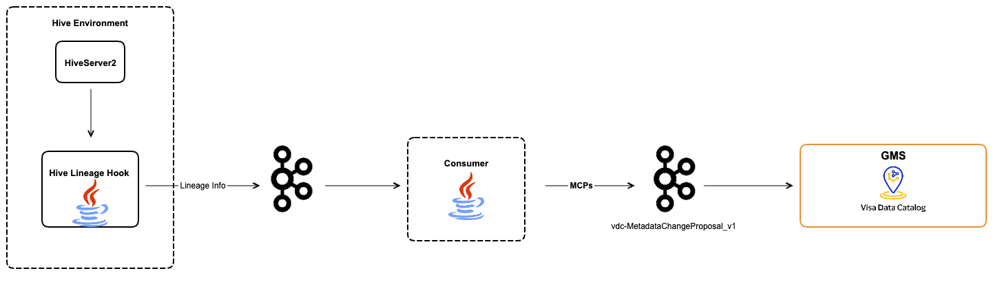

- **Start Date:** 2025-02-18  
- **RFC PR:** 000-hive-lineage.md  
- **Discussion Issue:**   
- **Implementation PR(s):**  

# Hive Lineage

## Summary

Hive Lineage refers to the ability to track and understand the flow of data within the Hive ecosystem by listening to Hive engine events, intercepting queries and capturing and documenting the lineage information, including the source tables, transformations performed, and destination table created/inserted as it moves through different tables and columns in Hive.

The use of Hive Lineage provides several benefits. It enables organisations to establish robust data governance practices by providing comprehensive lineage information. This lineage information aids in compliance with regulatory requirements and facilitates auditing and troubleshooting processes. Hive Lineage also enables impact analysis, allowing users to understand the effects of changes in schema, tables, or transformations on downstream processes and applications. It further helps identify data quality issues and anomalies by tracking data movement and transformations. By leveraging Hive Lineage, organisations can achieve better control over their data assets, improve data accuracy, and make informed decisions based on a clear understanding of data flow and dependencies within the Hive ecosystem.

## Motivation

The primary motivation for implementing Hive Lineage is to enhance our ability to track and understand the flow of data within the Hive ecosystem. By listening to Hive engine events, intercepting queries, and capturing lineage information, we aim to achieve several key benefits and support a variety of use cases.

### Use Cases Supported:

1. **Data Governance:** Hive Lineage enables robust data governance practices by providing comprehensive lineage information. This is crucial for maintaining control over data assets, ensuring data accuracy, and making informed decisions based on a clear understanding of data flow and dependencies.

2. **Regulatory Compliance:** With detailed lineage information, organizations can comply with regulatory requirements more effectively. Hive Lineage facilitates auditing processes by providing a transparent view of data movement and transformations, which is essential for demonstrating compliance.

3. **Impact Analysis:** Hive Lineage supports impact analysis by allowing users to understand the effects of changes in schema, tables, or transformations on downstream processes and applications. This helps in mitigating risks associated with changes and ensures the stability of data workflows.

4. **Troubleshooting:** By tracking data movement and transformations, Hive Lineage aids in troubleshooting data quality issues and anomalies. It provides insights into where and how data issues may have occurred, enabling quicker resolution and maintaining data integrity.

5. **Data Quality Monitoring:** Hive Lineage helps identify data quality issues by providing visibility into data transformations and movements. This enables proactive monitoring and management of data quality, ensuring that data remains accurate and reliable.

### Expected Outcome:

By implementing Hive Lineage, we expect to achieve the following outcomes:

- Improved data governance and control over data assets.
- Enhanced compliance with regulatory requirements.
- Better understanding of data flow and dependencies within the Hive ecosystem.
- Effective impact analysis for schema, table, and transformation changes.
- Quicker resolution of data quality issues and anomalies.
- Overall improvement in data accuracy and reliability.

## Detailed Design

The design for Hive Lineage involves leveraging Hive's LineageLogger Hook to capture lineage information, processing this information, and sending it to a Kafka topic. A Kafka consumer then processes these messages and sends metadata change proposals (MCPs) to the GMS (Graph Metadata Service). This design ensures efficient tracking and documentation of data flow within the Hive ecosystem.

### Implementation Details:

1. **LineageLogger Hook:**
    - We configure Hive to use the LineageLogger Hook by updating the Hive configuration to include this hook via client JAR. The JAR is registered in HiveServer to ensure it is invoked after query execution is finished and before the query result is published to the user. This ensures that the hook is invoked to capture lineage information after the query execution is completed ensuring the correct lineage is captured and doesn't get affected if the query execution fails.

2. **Hive Lineage Hook (Thin Client):**
    - **Extract Lineage:** The thin client, developed as a JAR, uses Hive hooks to capture lineage information from executed queries. Implement the thin client by extending the Hive hook interface. Capture events related to query execution, table creation, and data insertion.
    - **JSON:** The captured lineage information is converted to JSON format for consistency and ease of processing.
    - **Publish:** The JSON-formatted lineage information is sent to a predefined Kafka topic. This ensures that lineage data is reliably transmitted to downstream consumers.

3. **Kafka Consumer:**
    - The Kafka consumer listens to the predefined Kafka topic for incoming messages containing lineage information.
    - The consumer parses the JSON messages to extract lineage details and generate Metadata Change Proposals (MCPs) for dataFlow and dataJob entities.
    - The generated MCPs are sent to the GMS, specifically to the MCP topic `vdc-MetadataChangeProposal_v1`. This ensures that lineage information is integrated into the metadata service for further use.

### Usage Example:

1. **Capturing Lineage Information:**
   - When a user executes queries like `INSERT INTO tableB SELECT * FROM tableA` and `CREATE TABLE AS tableB SELECT * FROM tableA`, the LineageLogger Hook captures the lineage information.
   - The Hive Lineage Hook (Thin Client) converts this information into JSON format and sends it to the predefined Kafka topic.

```json
{
    "version": "1.0",
    "user": "testuser",
    "timestamp": 1739385858,
    "duration": 4338,
    "jobIds": [
        "application_1739344293933_0009"
    ],
    "engine": "tez",
    "database": "testdb",
    "hash": "a1e36e2a0feff89d08d9c3e2c9f1fb0d",
    "queryText": "CREATE TABLE new_user_details AS\nSELECT\nPerson,\nCurrent_Age,\nRetirement_Age,\nBirth_Year,\nBirth_Month,\nGender,\nAddress,\nApartment,\nCity,\nState,\nZipcode,\nLatitude,\nLongitude,\nPer_Capita_Income_Zipcode,\nYearly_Income_Person,\nTotal_Debt,\nFICO_Score,\nNum_Credit_Cards\nFROM test_user_details_input",
    "edges": [
        {
            "sources": [
                18
            ],
            "targets": [
                0
            ],
            "edgeType": "PROJECTION"
        },
        {
            "sources": [
                19
            ],
            "targets": [
                1
            ],
            "edgeType": "PROJECTION"
        },
        {
            "sources": [
                20
            ],
            "targets": [
                2
            ],
            "edgeType": "PROJECTION"
        },
        {
            "sources": [
                21
            ],
            "targets": [
                3
            ],
            "edgeType": "PROJECTION"
        },
        {
            "sources": [
                22
            ],
            "targets": [
                4
            ],
            "edgeType": "PROJECTION"
        },
        {
            "sources": [
                23
            ],
            "targets": [
                5
            ],
            "edgeType": "PROJECTION"
        },
        {
            "sources": [
                24
            ],
            "targets": [
                6
            ],
            "edgeType": "PROJECTION"
        },
        {
            "sources": [
                25
            ],
            "targets": [
                7
            ],
            "edgeType": "PROJECTION"
        },
        {
            "sources": [
                26
            ],
            "targets": [
                8
            ],
            "edgeType": "PROJECTION"
        },
        {
            "sources": [
                27
            ],
            "targets": [
                9
            ],
            "edgeType": "PROJECTION"
        },
        {
            "sources": [
                28
            ],
            "targets": [
                10
            ],
            "edgeType": "PROJECTION"
        },
        {
            "sources": [
                29
            ],
            "targets": [
                11
            ],
            "edgeType": "PROJECTION"
        },
        {
            "sources": [
                30
            ],
            "targets": [
                12
            ],
            "edgeType": "PROJECTION"
        },
        {
            "sources": [
                31
            ],
            "targets": [
                13
            ],
            "edgeType": "PROJECTION"
        },
        {
            "sources": [
                32
            ],
            "targets": [
                14
            ],
            "edgeType": "PROJECTION"
        },
        {
            "sources": [
                33
            ],
            "targets": [
                15
            ],
            "edgeType": "PROJECTION"
        },
        {
            "sources": [
                34
            ],
            "targets": [
                16
            ],
            "edgeType": "PROJECTION"
        },
        {
            "sources": [
                35
            ],
            "targets": [
                17
            ],
            "edgeType": "PROJECTION"
        }
    ],
    "vertices": [
        {
            "id": 0,
            "vertexType": "COLUMN",
            "vertexId": "testdb.new_user_details.person"
        },
        {
            "id": 1,
            "vertexType": "COLUMN",
            "vertexId": "testdb.new_user_details.current_age"
        },
        {
            "id": 2,
            "vertexType": "COLUMN",
            "vertexId": "testdb.new_user_details.retirement_age"
        },
        {
            "id": 3,
            "vertexType": "COLUMN",
            "vertexId": "testdb.new_user_details.birth_year"
        },
        {
            "id": 4,
            "vertexType": "COLUMN",
            "vertexId": "testdb.new_user_details.birth_month"
        },
        {
            "id": 5,
            "vertexType": "COLUMN",
            "vertexId": "testdb.new_user_details.gender"
        },
        {
            "id": 6,
            "vertexType": "COLUMN",
            "vertexId": "testdb.new_user_details.address"
        },
        {
            "id": 7,
            "vertexType": "COLUMN",
            "vertexId": "testdb.new_user_details.apartment"
        },
        {
            "id": 8,
            "vertexType": "COLUMN",
            "vertexId": "testdb.new_user_details.city"
        },
        {
            "id": 9,
            "vertexType": "COLUMN",
            "vertexId": "testdb.new_user_details.state"
        },
        {
            "id": 10,
            "vertexType": "COLUMN",
            "vertexId": "testdb.new_user_details.zipcode"
        },
        {
            "id": 11,
            "vertexType": "COLUMN",
            "vertexId": "testdb.new_user_details.latitude"
        },
        {
            "id": 12,
            "vertexType": "COLUMN",
            "vertexId": "testdb.new_user_details.longitude"
        },
        {
            "id": 13,
            "vertexType": "COLUMN",
            "vertexId": "testdb.new_user_details.per_capita_income_zipcode"
        },
        {
            "id": 14,
            "vertexType": "COLUMN",
            "vertexId": "testdb.new_user_details.yearly_income_person"
        },
        {
            "id": 15,
            "vertexType": "COLUMN",
            "vertexId": "testdb.new_user_details.total_debt"
        },
        {
            "id": 16,
            "vertexType": "COLUMN",
            "vertexId": "testdb.new_user_details.fico_score"
        },
        {
            "id": 17,
            "vertexType": "COLUMN",
            "vertexId": "testdb.new_user_details.num_credit_cards"
        },
        {
            "id": 18,
            "vertexType": "COLUMN",
            "vertexId": "testdb.test_user_details_input.person"
        },
        {
            "id": 19,
            "vertexType": "COLUMN",
            "vertexId": "testdb.test_user_details_input.current_age"
        },
        {
            "id": 20,
            "vertexType": "COLUMN",
            "vertexId": "testdb.test_user_details_input.retirement_age"
        },
        {
            "id": 21,
            "vertexType": "COLUMN",
            "vertexId": "testdb.test_user_details_input.birth_year"
        },
        {
            "id": 22,
            "vertexType": "COLUMN",
            "vertexId": "testdb.test_user_details_input.birth_month"
        },
        {
            "id": 23,
            "vertexType": "COLUMN",
            "vertexId": "testdb.test_user_details_input.gender"
        },
        {
            "id": 24,
            "vertexType": "COLUMN",
            "vertexId": "testdb.test_user_details_input.address"
        },
        {
            "id": 25,
            "vertexType": "COLUMN",
            "vertexId": "testdb.test_user_details_input.apartment"
        },
        {
            "id": 26,
            "vertexType": "COLUMN",
            "vertexId": "testdb.test_user_details_input.city"
        },
        {
            "id": 27,
            "vertexType": "COLUMN",
            "vertexId": "testdb.test_user_details_input.state"
        },
        {
            "id": 28,
            "vertexType": "COLUMN",
            "vertexId": "testdb.test_user_details_input.zipcode"
        },
        {
            "id": 29,
            "vertexType": "COLUMN",
            "vertexId": "testdb.test_user_details_input.latitude"
        },
        {
            "id": 30,
            "vertexType": "COLUMN",
            "vertexId": "testdb.test_user_details_input.longitude"
        },
        {
            "id": 31,
            "vertexType": "COLUMN",
            "vertexId": "testdb.test_user_details_input.per_capita_income_zipcode"
        },
        {
            "id": 32,
            "vertexType": "COLUMN",
            "vertexId": "testdb.test_user_details_input.yearly_income_person"
        },
        {
            "id": 33,
            "vertexType": "COLUMN",
            "vertexId": "testdb.test_user_details_input.total_debt"
        },
        {
            "id": 34,
            "vertexType": "COLUMN",
            "vertexId": "testdb.test_user_details_input.fico_score"
        },
        {
            "id": 35,
            "vertexType": "COLUMN",
            "vertexId": "testdb.test_user_details_input.num_credit_cards"
        }
    ]
}
```

2. **Processing Lineage Information:**
   - The Kafka consumer listens to the Kafka topic, consumes the JSON message, parses it, and generates an MCP.
   - The MCP is then sent to the GMS, ensuring that the lineage information is integrated into the metadata service.

### Architecture:



## How We Teach This

Teaching the concept of Hive Lineage effectively requires clear and consistent terminology, structured presentation, and alignment with existing patterns where applicable. Here's how we approach this:

### Terminology:

1. **Hive Lineage:** This term refers to the overall process of tracking and documenting the flow of data within the Hive ecosystem. It encompasses source tables, transformations, and destination tables.

2. **Data Governance:** This is the practice of managing data assets to ensure accuracy, consistency, and compliance. Hive Lineage is a key component of effective data governance.

3. **Impact Analysis:** This involves assessing the effects of changes in data schema, tables, or transformations on downstream processes. Hive Lineage supports this analysis.

4. **Data Quality Monitoring:** This is the process of ensuring data remains accurate, consistent, and reliable. Hive Lineage helps identify and resolve data quality issues.

## Drawbacks

No effect on existing functionality/customers. Apart from the need for a separate topic and consumer, it does not need any more changes to existing systems. The current design will be leveraging existing lineage API and MCP structure to process lineage information.

## Rollout / Adoption Strategy

The design of this feature is completely decoupled and should have minimal to no impact on the existing users, The changes planned should be compatible with existing DataHub ecosystem and rollout should not break any behaviour and adoption of this feature is totally optional.

## Future Work

With Hive lineage captured, enable various auditing capabilities including capturing QUERIES run against datasets, usage etc. And also enhance to capture the actual transformation of data behind the lineage.